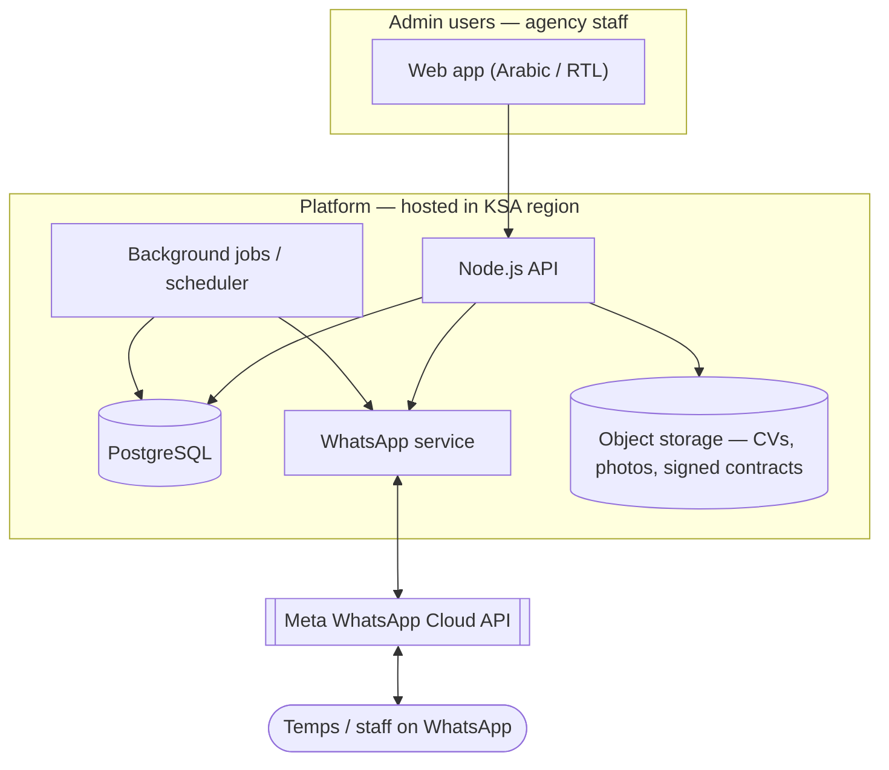
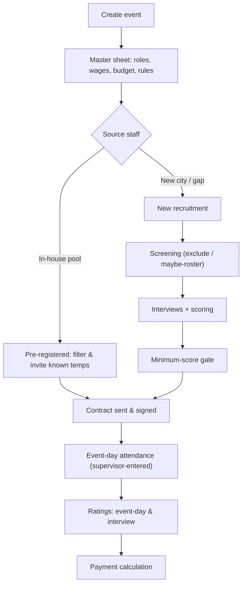
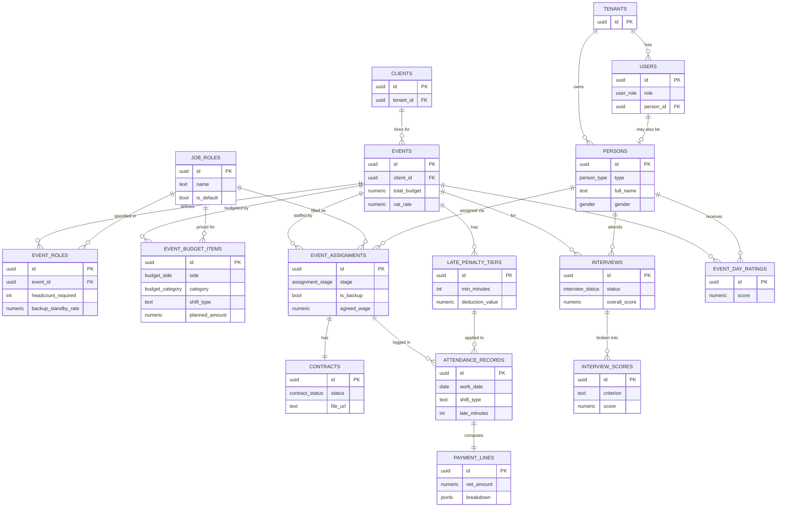

# System Architecture Document (SAD)

**Project:** Zell-force
**Market:** Saudi Arabia / Arab Middle East
**Status:** Pre-development architecture — living document
**Audience:** Engineers building the platform (and stakeholders who need the full picture)

> Legend used throughout: **[Decided]** = confirmed with the business · **[Proposed]** = engineering recommendation, not yet ratified · **[Open]** = needs a decision before or during build.

---

## 1. Purpose of this document

This document is the single reference a developer can read to understand *what* we are building, *for whom*, and *how the pieces fit together* — product scope, users, end-to-end workflow, data model, integrations, and the non-functional concerns (security, localization, infrastructure) that shape the build. It is deliberately broad rather than exhaustive on any one module; module-level specs (e.g. the payment engine, the WhatsApp service) live alongside it.

---

## 2. Product overview

A cloud platform that lets an event-staffing agency **recruit, schedule, manage, and cost out** the temporary workforce behind large events (fan zones, activations, hospitality, brand experiences). It replaces the spreadsheets, WhatsApp groups, and phone calls these agencies run on today with one system.

It is built around **two engines that meet in the middle**:

- an **event engine** — the master sheet: roles, headcounts, two-sided budgeting (what the client is billed vs. what staff/vendors cost), wage rules, late-penalty tiers, and live cost-vs-budget monitoring; and
- a **staff engine** — the workforce: profiles, dual rating histories (interview vs. event-day), fast filtering across hundreds of people, and saved/“smart” groups.

**What sets it apart from existing tools (e.g. Liveforce):** worker interaction runs entirely over **WhatsApp** — the channel the Saudi/Arab workforce already lives on — instead of requiring temps to install a separate crew app. Confirmations, reminders, availability checks, and signed-contract return all happen in chat. The product is also **Arabic-first** (RTL, Hijri dates, local pay structures), built for the market rather than translated into it.

---

## 3. Target audience & users

**Market / buyer.** Saudi-based event and temporary-staffing agencies — mid-size and growing — that field large, rotating pools of casual staff across short-notice jobs. Initial deployment is for **one small event-management company [Decided]**; the architecture is built **multi-tenant-ready** so it can become a product sold to many agencies later.

**User roles (people who log into the admin app):**

| Role | Responsibility |
|---|---|
| Owner | Full access; may also work events as a supervisor (linked to a person record) |
| Admin | Manage events, staff, budgets, settings |
| HR / Recruiter | Screening, interviews, scoring, contract issuance |
| Coordinator | Scheduling, assignments, day-to-day ops |
| Supervisor | On-site attendance and lateness entry |
| Viewer | Read-only |

**The workforce (mostly *not* app users — they interact via WhatsApp):**

- **Temps** — casual event staff (hosts, ushers, hospitality, drivers).
- **Permanent staff / employees** — internal staff who run the same pipeline but are classified separately; owners who supervise fall here. **[Decided]**

**Clients.** The companies that hire the agency for an event (e.g. the “BLACK ARABIA” client on the FIFA Fan Zone sheet). Tracked as records; client-facing logins/ratings are a future consideration **[Open]**.

---

## 4. Goals & non-goals (MVP scope)

**Goals.** A pilotable platform that covers: event creation + two-sided master-sheet budgeting; staff database with dual ratings and fast filtering; the full hiring journey (pre-registered pool *and* new recruitment, converging at signed contract); supervisor-entered event-day attendance with lateness/backup handling; **payment calculation** (not disbursement); WhatsApp confirmations/reminders/contract return; Arabic-first UX.

**Non-goals for MVP [Decided]:**

- No payment **disbursement** (no bank/WPS integration) — calculation only.
- No separate **crew-facing app** — WhatsApp + temporary tokenized web links cover the worker side.
- No automated CV parsing / candidate auto-scoring.
- Multi-tenancy is **scaffolded but not activated** (single tenant runs first).
- The cross-event analytics “master-master sheet” is future work.

---

## 5. System context & high-level architecture

**Components**

- **Web app** — admin interface used by agency staff. Arabic-first, RTL, responsive. **[Proposed]** React (or Next.js) with an RTL-aware component setup.
- **Node.js API** — the application core: business logic, auth, the hiring pipeline, budgeting, payment calculation, and the data-access layer (every query scoped by `tenant_id`). **[Decided]** Node.js + PostgreSQL.
- **PostgreSQL** — single relational store; `tenant_id` on every table, RLS-ready. **[Decided]**
- **WhatsApp service** — a thin internal module wrapping Meta’s Cloud API: send templates/interactive messages, receive webhooks (button taps, inbound documents), download media. **[Decided]** direct Cloud API, no BSP.
- **Object storage** — CVs, candidate photos, and signed contract PDFs, in the KSA region for data residency. **[Proposed]**
- **Background jobs / scheduler** — reminders, payment/actuals recalculation, rating aggregation, smart-group refresh. **[Proposed]**

**Suggested stack [Proposed]:** Node.js (API), PostgreSQL, React/Next.js (RTL), a job runner (e.g. BullMQ/pg-boss), object storage with a KSA region, built with Claude Code / Codex.

---

## 6. Core domains & features

**Event engine**
- Event setup: client, city, dates, status.
- Master sheet (two-sided budget): per-role headcount; **billable** rates (client quote) and **cost** rates (staff/vendor pay), each with **shift variants** (e.g. 6hr / 10hr) × days × quantity; meals; accommodation; transport; operational and other costs.
- Wage & penalty rules: daily wages, tiered late penalties, backup standby vs. takeover pay.
- Live status & cost monitor: confirmed-vs-needed per role; planned vs. actual cost; projected vs. actual income (margin).

**Staff engine**
- Profiles: city, age, gender, photos, CV, skills/attributes; classification (temp vs. permanent).
- Dual ratings: **interview** scores (communication, presentation, English, …) and **event-day** ratings (aggregated across multiple events/clients) — kept distinct.
- Notes & history.
- Fast multi-attribute **filters** across hundreds of staff.
- **Groups / saved batches**: manual rosters and criteria-driven “smart” groups (e.g. an all-female roster for women-only events); bulk invite/assign/message.

**Hiring journey (bridges the engines)**
- Two entry paths (pre-registered pool / new recruitment) converging at signed contract.
- Screening (exclude on criteria; “maybe” roster saved for future events).
- Interviews: scheduling (WhatsApp reminder), scoring, per-event minimum-score gate.
- Contracts: issue, sign-by deadline, accepted/pending/rejected; PDF e-signature returned via WhatsApp **or** manually uploaded.
- Event-day attendance (supervisor-entered): lateness tiers; backup standby vs. takeover.
- Ratings & **payment calculation**.

**Cross-cutting**
- WhatsApp messaging (see §9).
- Arabic-first localization & minimalist UX (see §12).
- Multi-tenant-ready foundations & access control (see §11).

---

## 7. End-to-end workflow

**Narrative.** After an event and its master sheet are created, sourcing forks. The **pre-registered path** filters the existing pool (city, gender, age, interview/event-day ratings, skills), checks availability, and sends event details + contract. The **new-recruitment path** (used when entering a new city) takes applicants from the intake form through screening, interviews and scoring, gated by the event’s minimum score. Both paths **converge** the moment a contract is signed — modeled by a single `event_assignments` row reaching the `accepted`/`confirmed` stage. From there it is one shared track: daily attendance entered on-site, ratings captured, and payment computed from attendance against the master-sheet rules.

---

## 8. Data model / database design

**Principles.** UUID keys; `timestamptz` everywhere; `numeric` for money; `tenant_id` on every table with **Row-Level Security** ready to activate; enums for stable status sets, lookup tables for anything tenants customize (job roles, skills); money is **calculated, never stored as truth**. Authoritative DDL: `database.js` (consolidated) / `schema.sql` + `002_event_budgets.sql`.

**Key modeling decisions**
- **One `persons` table** with a `person_type` flag (temp/permanent) — not two tables — because both share every downstream relationship. An owner-supervisor is a permanent person linked to a `users` login.
- **“Roles” split in two:** `job_roles` (staffing positions, tenant-editable) vs. `user_role` (app permissions enum).
- **`event_assignments` is the convergence spine** — both sourcing paths land here; a `stage` column tracks the funnel. Contracts, attendance, and ratings hang off it.
- **Two-sided budget** in `event_budget_items` — one row per master-sheet line, `side` = billable/cost, `category` = staff/meal/accommodation/transport/operational/other; staff lines carry role + shift + rate × days × qty; `planned_amount` is a generated column; `event_budget_summary` view reproduces Total In / Out / projected & actual income.
- **Shift worked drives pay** — `attendance_records.shift_type` selects which cost rate applies that day.

### 8.1 Core entity map

### 8.2 Table catalog

| Table | Purpose |
|---|---|
| `tenants` | One row per agency; root of multi-tenancy |
| `users` | Admin login accounts; optional link to a `persons` record |
| `persons` | Workforce — temps + permanent staff |
| `clients` | Companies that hire the agency for events |
| `events` | Event header + budget header fields (VAT, payment terms) |
| `job_roles` | Staffing positions; seeded defaults + tenant custom |
| `event_roles` | Staffing plan per event/role (headcount, backup count, standby rate) |
| `event_budget_items` | Two-sided master-sheet lines (billable & cost) |
| `late_penalty_tiers` | Tiered lateness deductions per event |
| `skills` / `person_skills` | Attribute tags and their assignment |
| `consents` | Opt-in records (WhatsApp/data), captured at intake |
| `staff_groups` / `staff_group_members` | Saved/smart batches and membership |
| `event_assignments` | Hiring-pipeline spine; both paths converge here |
| `interviews` / `interview_scores` | Interview scheduling and per-criterion scores |
| `contracts` | Issued contracts, signature status, file |
| `attendance_records` | Per-person, per-day attendance, lateness, backup outcome |
| `event_day_ratings` | Event-day performance ratings (multi-source) |
| `payment_lines` | One computed pay line per attendance day + breakdown |
| `message_templates` / `messages` | WhatsApp templates and the message log |
| `notes` | Polymorphic notes on people, events, etc. |
| *(view)* `event_budget_summary` | Total In/Out, projected & actual income per event |

---

## 9. WhatsApp integration

- **Channel [Decided]:** Meta WhatsApp **Cloud API**, direct (no BSP). At <1,000 messages/month to Saudi numbers, going direct is far cheaper than a BSP’s monthly fee.
- **Message types:** business-initiated **utility templates** (interview/shift confirmations, reminders) with interactive **confirm/decline** buttons; free-form replies only inside the 24-hour customer-service window opened by a user’s message.
- **Inbound documents [Decided]:** signed contract PDFs returned over WhatsApp are received via webhook (message → media ID → download over HTTPS → store). Manual upload is the fallback.
- **Webhook reliability:** handlers must be **idempotent**, deduping on the WhatsApp message ID (`messages.wa_message_id` is unique); media download URLs expire quickly (~5 min) so fetch-and-store immediately; use a **permanent System User token** in production.
- **Consent [Decided]:** captured in the intake/application form; stored in `consents`.
- **Cost note:** keep templates strictly transactional to stay in the cheap *utility* category (~0.05–0.06 SAR each); promotional content reclassifies them as *marketing* (far higher).

---

## 10. Payment calculation engine

Resolves **one attendance row → one `payment_lines` row** (calculation only — no disbursement).

1. **Base rate:** absent/excused → 0; backup *standby* → standby rate; otherwise the **active rate** = `agreed_wage` if set, else the cost-side staff budget item’s rate for the **shift worked**.
2. **Lateness:** if late, match the event’s penalty tier for `late_minutes`; deduct fixed or percent of base, capped at base.
3. **Adjustments:** optional takeover bonus / manual adjustment.
4. **Net** = `max(0, base − late_deduction + adjustments)`.
5. **Persist** to `payment_lines` with a `breakdown` JSON (rate source, deductions, additions, net) for display.
6. **Reconcile:** roll daily nets up into the matching staff budget items’ `actual_amount`, lighting up “Total Actual Out” in the summary view.

The calculator is a **pure function** (resolved inputs in, amount + breakdown out) so its many edge cases are exhaustively unit-testable. This is the highest-risk logic in the system and should be test-first.

---

## 11. Security, access control & compliance

- **Authentication [Proposed]:** email + password (hashed, e.g. bcrypt/argon2), session or JWT; per-tenant user records.
- **Authorization:** role-based (`user_role`); the data-access layer scopes every query by `tenant_id`.
- **Multi-tenancy [Decided scaffold]:** `tenant_id` everywhere now; activate Postgres **Row-Level Security** when onboarding a second tenant (`SET app.tenant_id` per connection + per-table policies).
- **Data residency [Decided]:** hosted on a server in **Saudi Arabia**; CVs, photos, and signed contracts stored in-region.
- **Consent & sensitive data:** opt-in captured at intake (`consents`); appearance/age/gender are used in screening for hospitality roles, so photo/appearance data needs deliberate access limits and retention rules. **[Open]** formalize retention policy.
- **E-signature caveat [Open]:** a PDF returned over WhatsApp is a *signed document*, not a cryptographically verifiable e-signature with an audit trail — acceptable operationally, but note the limitation if a contract is ever disputed.
- **Audit logging [Proposed]:** record who changed assignments, attendance, budgets, and payments.

---

## 12. Localization & UX principles

- **Arabic-first, RTL** layout from day one; bilingual Arabic/English. **[Decided]**
- **Hijri calendar** option alongside Gregorian. **[Decided]**
- Local pay structures and role/shift conventions; the product should *feel Arab-made*, not translated. **[Decided]**
- **Minimalist, non-technical UX** — usable by non-tech-savvy ops staff; fast filters that distinguish hundreds of staff quickly; bulk operations and saved batches as first-class actions. **[Decided]**

---

## 13. Non-functional requirements

- **Performance:** staff filtering across hundreds–thousands of profiles must feel instant; supported by indexed filter columns and denormalized rating caches on `persons`.
- **Scalability:** single tenant now; schema and isolation ready for many tenants without migration.
- **Reliability:** idempotent WhatsApp webhooks; transactional writes for attendance→payment→budget.
- **Maintainability:** clear domain boundaries (event vs. people engines), pure calculation logic, migration-based schema evolution.
- **Security & privacy:** in-region data, least-privilege access, consent-gated messaging.

---

## 14. Deployment & infrastructure **[Proposed]**

- Hosting in a **KSA region** (data residency).
- Environments: dev / staging / production; secrets via environment variables.
- **Schema:** `database.js` initializes a clean database (dev/first-boot); once live, evolve via **numbered migrations** with a real tool (node-pg-migrate / Knex / Drizzle / Prisma).
- Automated **backups** of PostgreSQL and object storage; basic monitoring/logging/alerting.
- CI running the test suite (with emphasis on the payment calculator).

---

## 15. Integration points & external dependencies

| Integration | Status | Notes |
|---|---|---|
| Meta WhatsApp Cloud API | **[Decided]** | Templates, interactive messages, inbound media, webhooks |
| PDF e-signature / storage | **[Decided]** | Generate contract PDFs; ingest signed PDFs (WhatsApp or manual) |
| Object storage (KSA) | **[Proposed]** | CVs, photos, contracts |
| Accounting (e.g. Xero) | Future | Export computed pay |
| Payment disbursement / WPS | Future | Out of MVP scope |

---

## 16. Background jobs & scheduled tasks **[Proposed]**

- Send scheduled **interview/shift reminders** (utility templates).
- **Payment/actuals recalculation** after attendance entry; refresh `event_budget_items.actual_amount`.
- **Rating aggregation** to refresh `persons.rating_event_avg` / `rating_interview_avg` caches.
- **Smart-group** re-evaluation as the pool changes.
- Token/health checks for the WhatsApp integration.

---

## 17. Open decisions & assumptions

| Topic | Decision / status |
|---|---|
| Crew interaction | **[Decided]** WhatsApp + temporary tokenized web links for reports; no crew app in MVP |
| Attendance capture | **[Decided]** Supervisor enters (paper → app); platform calculates day cost |
| Contracts | **[Decided]** PDF e-signature; auto-ingest via WhatsApp + manual upload; hosted in KSA |
| Payments | **[Decided]** Calculation only; no disbursement in MVP |
| Ratings input | **[Decided for MVP]** Entered internally; client/per-host external rating links **[Open]** |
| Permanent staff | **[Decided]** Same pipeline, classified separately; owners can be supervisors |
| Roles taxonomy | **[Decided]** Seeded defaults + tenant-editable custom roles |
| Consent | **[Decided]** Captured in intake form |
| Shift-type taxonomy | **[Open]** Confirm canonical shift types (6hr/10hr/custom) |
| Multi-tenant activation | **[Open]** Timing of RLS turn-on / tenant onboarding |
| Sensitive-data retention | **[Open]** Formal retention/access policy for photos & appearance notes |

---

## 18. Roadmap / phasing

- **MVP** — everything in §4 goals (single tenant), ~lean target.
- **Fast-follow** — client/per-host rating links; richer reporting; deeper compliance fields (Iqama/work-permit).
- **Future** — “master-master sheet” cross-event analytics (revenue trends, post-mortems, what-went-wrong notes); optional crew-facing app; **multi-tenancy activation** (RLS, tenant onboarding, billing); accounting/payment integrations.

---

## 19. Implementation plan (two developers + Claude Code / Codex)

- **Phase 0 (together, ~2 wks):** freeze the data model and shared contracts; auth, tenancy-ready schema, RTL/i18n shell, WhatsApp service skeleton, monorepo + CI + generated shared types. Name one dev “schema steward.”
- **Track A — Event engine + money + messaging infra:** master sheet/budget, live status, attendance entry, payment engine; owns the WhatsApp service as shared infra.
- **Track B — People engine + hiring pipeline:** staff DB, filters/groups, screening → interviews → scoring, contracts, pre-registered path.
- **Five integration seams:** shared schema/types; WhatsApp service; staff→event handoff (confirmed staff for an event); event→staff reads (roles/wages); ratings (written centrally, read by filters).
- **Working model:** `CLAUDE.md` / `AGENTS.md` holding schema + contracts + conventions; spec-first features with acceptance criteria; agents implement, humans review/integrate; heaviest agent use on payment/attendance **test suites**.
- **Timeline:** ~**10–12 calendar weeks** to a lean, pilotable platform (Phase 0 + parallel tracks + integration/hardening + pilot). Two devs don’t halve it — Phase 0 and final integration don’t parallelize.

---

## 20. Glossary

- **Temp / permanent staff** — casual vs. internal workforce; same pipeline, different classification.
- **Backup — standby vs. takeover** — a backup attends from start; if unused, leaves at noon for a *standby* rate; if they fill a no-show, they earn the *takeover* (active) rate.
- **Master sheet** — the per-event, two-sided budget (billable vs. cost).
- **Billable vs. cost** — what the client is charged vs. what staff/vendors are paid; the gap is margin.
- **Shift type** — e.g. 6hr / 10hr; determines the rate applied for a worked day.
- **CSW (customer-service window)** — the 24-hour window opened when a user messages the business, during which free-form WhatsApp replies are free.
- **Utility template** — a transactional WhatsApp template (confirmations/reminders); the cheapest message category.
- **RLS (Row-Level Security)** — Postgres feature that auto-scopes queries by tenant once activated.
- **Convergence (event_assignments)** — the single table/stage where the pre-registered and recruitment paths meet at a signed contract.
