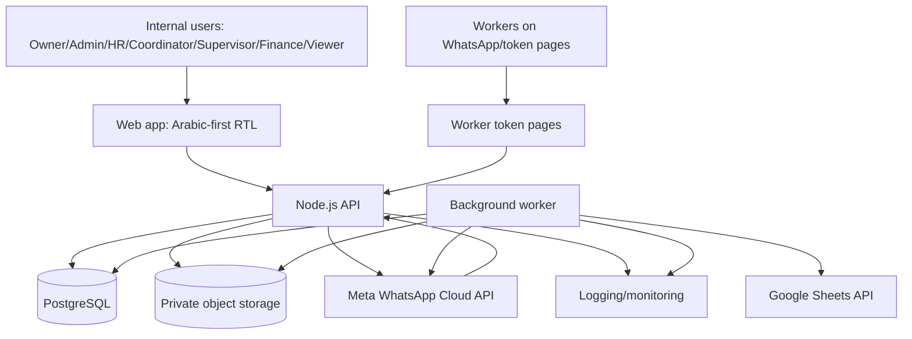

# Technical Architecture Document

**Project:** Zell-force  
**Client / Business Owner:** MAG Events  
**Document status:** Recommendations approved; provider/business details still TBD  
**Date:** 2026-06-10  
**Source inputs:** `SYSTEM_ARCHITECTURE.md`, `database.js`, `docs/00_Engineering_Methodology.md`, `docs/04_Functional_Requirements.md`, `docs/05_Non_Functional_Requirements.md`, `docs/06_Data_Model_Database_Requirements.md`, `docs/07_UI_UX_Wireframe_Specification.md`

---

## 1. Purpose

This document defines the recommended technical architecture for Zell-force MVP. It translates product requirements, data requirements, UI wireframes, scale expectations, security needs, and mandatory engineering methodology into an implementation-ready architecture.

The architecture must guide:

- frontend developers;
- backend developers;
- database designers;
- DevOps/hosting setup;
- QA engineers;
- AI coding agents;
- future maintainers.

---

## 2. Information Already Known

| Area | Known decision / input |
|---|---|
| Product type | Internal event-workforce management web application |
| Primary market | Saudi Arabia / Gulf region |
| Language | Arabic-first RTL, English fallback |
| Core workflow | Google Form/Sheet import -> recruitment -> staffing -> WhatsApp -> contracts -> attendance -> payment calculation -> review/export |
| Internal roles | Owner, Admin, HR, Coordinator, Supervisor, Finance, Viewer |
| Worker access | WhatsApp + tokenized mobile web pages; no worker app login in MVP |
| Client access | Client records only; no client portal in MVP |
| Payments | Calculation and export only; no disbursement/WPS in MVP |
| Backend source decision | Node.js + PostgreSQL |
| Database | PostgreSQL, tenant-ready, UUID keys, `tenant_id` everywhere |
| Files | CVs, photos, signed contracts in object storage, preferably KSA region |
| Integrations | Google Sheets API, Meta WhatsApp Cloud API, object storage |
| Methodology | Deep Modules, Actions vs operational Modules, DRY config truth, mandatory TDD |
| MVP timeline | 10-12 weeks target |

---

## 3. Missing Information

| Item | Status | Impact |
|---|---|---|
| Final hosting provider | TBD / needs client confirmation | Deployment, data residency, backups |
| Exact Google Form/Sheet fields | TBD | Import mapping and validation |
| Exact staff/event volume | TBD | Performance tuning, DB indexes, pagination |
| Exact concurrent users | TBD | infrastructure sizing |
| Exact shift taxonomy | TBD | budget/payment rules |
| Exact report/export formats | TBD | export module |
| Legal retention periods | Needs legal confirmation | privacy, deletion, backups |
| MFA requirement | Needs client confirmation | auth scope |
| Offline attendance behavior | Needs client confirmation | mobile complexity |
| RLS activation timing | TBD | tenant isolation hardening |

---

## 4. Architecture Assumptions

| ID | Assumption |
|---|---|
| A-001 | MVP starts as single tenant but every tenant-owned record is tenant-scoped. |
| A-002 | PostgreSQL is primary source of truth for operational data. |
| A-003 | Background jobs can run as a separate worker process. |
| A-004 | A server-side API owns all business rules; frontend only renders allowed actions. |
| A-005 | Object storage supports private files and signed URLs. |
| A-006 | Worker token pages are stateless from the worker perspective and scoped by signed tokens. |
| A-007 | Payment calculation is pure/test-first and separated from payment review workflow. |
| A-008 | KSA-region hosting/storage is required where available. |

---

## 5. Architecture Overview

Zell-force should use a modular TypeScript web architecture:

- a responsive Arabic-first web app for internal users;
- a small token-page web surface for workers;
- a Node.js API owning business rules and permissions;
- PostgreSQL as relational source of truth;
- a background worker for imports, reminders, recalculation, aggregation, and exports;
- object storage for files;
- external adapters for Google Sheets and Meta WhatsApp Cloud API.



Primary rule:

```text
Actions own workflow meaning.
Modules own reusable mechanics.
Adapters own external provider details.
```

---

## 6. Recommended Stack

### 6.1 Stack Summary

| Layer | Recommendation | Status | Reason |
|---|---|---|---|
| Language | TypeScript | Recommended default | Shared types, safer refactoring, strong AI-agent maintainability |
| Frontend | Next.js + React | Recommended default | Web app, server-rendered token pages, routing, i18n-friendly structure |
| API | Node.js TypeScript API with Express.js | Accepted | Explicit API boundary, broad middleware ecosystem, Better Auth Express handler support |
| Database | PostgreSQL | Decided | Relational workflows, transactions, money precision, tenant readiness |
| Query/data access | SQL migrations + typed query layer, e.g. Kysely | Recommended default | Keeps SQL control while improving type safety |
| Jobs | Postgres-backed job runner, e.g. pg-boss | Recommended default for MVP | Avoids Redis dependency first; upgrade path if needed |
| Object storage | Private S3-compatible storage in KSA region where possible | Recommended default | Signed URLs, portability |
| Auth | Better Auth server-side sessions with email/password | Accepted | Browser security, revocation, simple MVP, Express-compatible handler |
| Validation | Shared schemas, e.g. Zod | Recommended default | Request validation and shared typed contracts |
| UI system | Tokenized component system with RTL support | Recommended default | Consistent with Phase 7 |
| Tables/grids | TanStack Table or equivalent | Recommended default | Dense data, filters, sorting, column control |
| Testing | Vitest/Jest + integration tests + Playwright | Recommended default | TDD, module tests, end-to-end core flows |
| CI | GitHub Actions or equivalent | Recommended default | Test/lint/build gates |
| Deployment | Dockerized apps in KSA-region hosting | Recommended default | Portability, controlled environment |

### 6.2 Stack Decision Status

| Decision | Recommended default | Status |
|---|---|---|
| Monorepo tool | Bun workspaces | Approved recommendation |
| Frontend framework | Next.js + React | Approved recommendation |
| API framework | Express.js | Accepted |
| ORM/query tool | Kysely + SQL migrations | Approved recommendation |
| Job runner | pg-boss | Approved recommendation |
| Hosting provider | KSA-region cloud/VPS/provider TBD | Needs provider selection |
| File storage provider | KSA-region S3-compatible storage TBD | Needs provider selection |
| Auth library | Better Auth | Accepted |

---

## 7. Recommended Repository Structure

Recommended monorepo shape:

```text
apps/
  web/
    src/
      app/
      screens/
      components/
      design-system/
      i18n/
      routes/
  api/
    src/
      actions/
      modules/
      adapters/
      db/
      http/
      auth/
      config/
  worker/
    src/
      jobs/
      schedules/
packages/
  domain/
    roles/
    statuses/
    permissions/
    schemas/
    money/
  db/
    migrations/
    generated-types/
  ui/
    tokens/
    primitives/
    patterns/
  config/
    env-schema/
tests/
  modules/
  actions/
  integration/
  e2e/
docs/
  adr/
```

DRY rule:

- keep packages only when shared by multiple apps or needed as single source of truth;
- do not extract shallow packages just for tidy folders;
- role/status/permission/env constants must be single-source.

---

## 8. Backend Architecture

### 8.1 Backend Layers

| Layer | Owns | Must not own |
|---|---|---|
| HTTP routes/controllers | Parse request, call Action, map result to HTTP | Business rules, provider mechanics |
| Actions | Auth, role checks, workflow rules, stage transitions, user-facing errors | SDK calls copied between flows |
| Modules | Deep reusable mechanics and pure domain logic | Hidden DB mutations without explicit contract |
| Adapters | Provider-specific IO: Google, WhatsApp, storage, email future | Domain policy |
| DB/repositories | Query execution and transaction helpers | Business workflow decisions |

### 8.2 Required Actions

| Action group | Examples |
|---|---|
| Applicant actions | `syncApplicantRows`, `reviewApplicantRow`, `mergeApplicant`, `rejectApplicant` |
| Staff actions | `createPerson`, `updatePerson`, `filterStaff`, `createStaffGroup` |
| Event actions | `createEvent`, `updateEvent`, `configureEventRole`, `approveRoster` |
| Budget actions | `addBudgetLine`, `updateBudgetLine`, `configureLatePenaltyTier` |
| Assignment actions | `assignStaff`, `sendInvitation`, `recordWorkerResponse` |
| Contract actions | `issueContract`, `ingestSignedContract`, `manualUploadContract` |
| Attendance actions | `recordAttendance`, `recordBackupOutcome`, `reopenAttendance` |
| Payment actions | `recalculatePayments`, `createPaymentBatch`, `reviewBatch`, `approveBatch`, `exportBatch` |
| Message actions | `sendTemplateMessage`, `handleWhatsAppWebhook`, `retryFailedMessage` |
| Settings actions | `updateTenantSettings`, `manageUsers`, `manageCatalogs` |

### 8.3 Required Deep Modules

| Module | Interface responsibility | Key tests |
|---|---|---|
| Applicant Intake Import | Read Sheet rows, map fields, validate rows, dedupe keys, return import result | malformed rows, missing fields, repeated sync idempotency |
| Staff Filtering | Accept filter criteria and return paginated/scored candidates | combined filters, pagination, performance seed test |
| Assignment Pipeline | Validate stage transitions, assignment uniqueness, confirmation rules | invalid transition, duplicate person/event |
| Budget Engine | Calculate planned totals, billable/cost summaries, rate lookup candidates | money precision, missing rate, role/shift match |
| Attendance Capture | Validate status, late minutes, lock rules, backup outcome shape | late validation, duplicate attendance, locked edit |
| Payment Calculator | Pure calculation from resolved attendance/rate/rule inputs | absent, excused, standby, takeover, tier boundaries, negative net prevention |
| WhatsApp Messaging | Send template, parse webhook, dedupe provider events, classify failures | duplicate webhook, send failure, button response |
| Contract Ingestion | Accept manual/WhatsApp file, validate/store, link to contract | duplicate media, failed download, wrong MIME |
| Report Export | Generate CSV/XLSX with role-safe columns | export columns, approval gating, sensitive exclusion |
| Audit Log | Build immutable audit entries for critical changes | before/after shape, required reason |

### 8.4 Interface Rules

Every Module Interface must define:

- input types;
- output types;
- invariants;
- error modes;
- idempotency behavior;
- transaction requirements;
- performance expectations;
- test cases.

The Interface is the test surface.

---

## 9. Frontend Architecture

### 9.1 Frontend App Areas

| Area | Routes | Notes |
|---|---|---|
| Auth | `/login`, `/auth/reset` | No marketing UI |
| Internal app shell | `/dashboard`, `/staff`, `/events`, etc. | RTL sidebar, topbar, role nav |
| Event workspace | `/events/:id/*` | Object page tabs |
| Supervisor mobile | `/m/*` | Mobile-first shell, assigned-event scope |
| Worker token pages | `/t/*` | No internal app shell, token-only |
| Settings | `/settings/*` | Owner/Admin only |
| Reports | `/reports/*` | Role-scoped |

### 9.2 Component Structure

| Component type | Examples | Rules |
|---|---|---|
| Primitives | Button, input, select, dialog, drawer, badge | Token-driven, RTL-aware, accessible |
| Patterns | Data table, filter bar, roster row, spreadsheet grid, summary list | Reusable across screens |
| Screens | Staff DB, Event Budget, Payment Batch Review | Compose patterns; no duplicated mechanics |
| Layouts | App shell, mobile shell, token shell | Role-specific navigation |

### 9.3 UI State Management

Recommended default:

- server state via query/mutation library;
- URL stores filters, pagination, table views where shareable;
- local component state for form drafts and UI-only state;
- no global store unless repeated cross-screen state proves need.

### 9.4 Frontend Guardrails

- frontend permission checks improve UX only; backend enforces security;
- no card grids for dense operational data;
- tables need search, filters, saved views, column control, bulk action state;
- Arabic RTL is default;
- mixed LTR values use `dir="ltr"` or `bdi`;
- no raw hex/spacing/font sizes outside design tokens;
- worker token pages never load internal app shell or nav.

---

## 10. Database Architecture

### 10.1 Core Database Principles

| Principle | Requirement |
|---|---|
| Tenant-ready | `tenant_id` on tenant-owned tables |
| Relational integrity | FK constraints for core workflows |
| Money precision | `numeric`, not float |
| Time | `timestamptz` for events/audit/job timing |
| IDs | UUID primary keys |
| Statuses | enums or lookup tables for controlled values |
| Migrations | numbered migrations after initial schema freeze |
| RLS-ready | schema supports future PostgreSQL RLS activation |
| Auditability | critical changes write audit logs |

### 10.2 Required Schema Work Before Build

| Gap | Required architecture action |
|---|---|
| Missing `supervisor`, `finance` role enum | Add migration or migrate role model |
| No import staging | Add `applicant_import_runs`, `applicant_import_rows` |
| No audit log | Add `audit_logs` |
| No supervisor-event access | Add `event_supervisors` |
| No payment batch/review model | Add `payment_batches`, `payment_batch_lines` |
| File URLs only | Add `files` metadata table |
| Raw shift type text | Add `shift_types` lookup |
| Tenant settings scattered | Add `tenant_settings` |
| Export trace missing | Add `export_runs` |

### 10.3 Transaction Boundaries

| Workflow | Transaction rule |
|---|---|
| Applicant review accept/merge/reject | decision + person update + audit in one transaction |
| Event role/budget update | budget change + audit + summary refresh in one transaction where possible |
| Attendance record | attendance write + audit + payment recalculation trigger in one transaction or reliable job enqueue |
| Payment approval | batch state + included lines lock + audit in one transaction |
| Contract ingestion | contract file metadata + contract status + message status in one transaction after file storage succeeds |

### 10.4 Index Strategy

Minimum index focus:

- `persons`: tenant/status/city/gender/type, phone, rating caches;
- `event_assignments`: event, person, tenant/stage, event/person uniqueness;
- `events`: tenant/status/client/date;
- `applicant_import_rows`: tenant/status/source_hash;
- `attendance_records`: assignment/date uniqueness, event/date query support;
- `payment_batches`: tenant/event/status;
- `messages`: WhatsApp message ID uniqueness, related entity;
- `audit_logs`: tenant/entity/action/created_at.

---

## 11. Authentication and Authorization

### 11.1 Authentication

Accepted MVP approach:

- Better Auth email/password for internal users;
- Better Auth managed password hashing;
- Better Auth server-side sessions in secure, HTTP-only cookies;
- Better Auth default identity tables are `"user"`, `session`, `account`, and `verification`;
- Zell-force `users` stores tenant, role, active state, and optional Person link through `auth_user_id`;
- Next.js uses one Better Auth React client against the Express API with credentialed requests;
- session invalidation on user deactivation;
- optional/fast-follow MFA for Owner/Admin if client requires;
- worker token pages use signed scoped tokens, not login sessions.

### 11.2 Authorization

RBAC roles:

```text
owner, admin, hr, coordinator, supervisor, finance, viewer
```

Authorization rules:

- API checks permission for every action;
- queries are tenant-scoped;
- Supervisor queries are assigned-event scoped;
- Finance can review/export payments but Owner/Admin approve;
- Viewer is read-only and sensitive-data restricted;
- Owner/Admin override most operational workflows;
- future custom permissions must not require rewriting every route.

### 11.3 Permission Architecture

Use central permission map:

```text
role -> permission -> scope
```

Examples:

| Permission | Scope |
|---|---|
| `event.read` | tenant or assigned event |
| `event.update` | tenant |
| `staff.read_sensitive` | tenant, restricted roles |
| `attendance.write` | assigned event for Supervisor, tenant for Admin |
| `payment.review` | tenant |
| `payment.approve` | Owner/Admin only |
| `settings.manage_users` | Owner/Admin only |

This permission map is single-source and imported by API tests, route guards, and UI nav rendering.

---

## 12. File Storage Architecture

### 12.1 File Types

| File kind | Source | Sensitivity | Access |
|---|---|---|---|
| CV | manual/import future | High | Owner/Admin/HR |
| Staff photo | manual/import future | High | Owner/Admin/HR, Coordinator limited TBD |
| Signed contract | WhatsApp/manual | High | Owner/Admin/HR, Finance dispute TBD |
| Report export | system | Medium/high by report | Requester/allowed roles |

### 12.2 Storage Rules

- private bucket by default;
- signed URLs for temporary access;
- no public CV/photo/contract URLs;
- file metadata stored in `files`;
- `storage_key`, not public URL, is source of truth;
- file access checked through API;
- MIME type and size validation;
- checksum recommended for integrity;
- deletion/retention policy TBD.

### 12.3 Upload Flow

```text
Client requests upload -> API validates permission -> signed upload URL or API upload
-> file stored -> file metadata saved -> owner entity linked -> audit where required
```

For WhatsApp media:

```text
Webhook -> dedupe message -> download media quickly -> store private file
-> create file metadata -> link contract -> update status -> audit
```

---

## 13. External Integrations

### 13.1 Google Sheets Applicant Intake

Architecture:

- Admin config stores Sheet ID/range and field mapping in `tenant_settings`;
- Applicant Intake Import Module reads rows through Google Sheets Adapter;
- import run creates `applicant_import_runs`;
- each row creates/updates `applicant_import_rows`;
- HR accepts/merges/rejects rows before person creation;
- scheduled import runs through worker.

Idempotency:

- use source row ID plus row hash where possible;
- repeated sync must not duplicate review rows or accepted persons.

Open:

- exact source row identity strategy: row number, timestamp, response ID, or hash.

### 13.2 Meta WhatsApp Cloud API

Architecture:

- WhatsApp Messaging Module owns message send/parse/dedupe logic;
- Adapter owns provider HTTP details;
- inbound webhook calls API route;
- message records store `wa_message_id`;
- template records track language/category/status;
- signed contract media is downloaded and stored immediately.

Idempotency:

- dedupe inbound and status webhooks by provider message ID;
- confirm/decline action must be safe if webhook retries.

### 13.3 Object Storage

Architecture:

- File Storage Adapter abstracts provider;
- private object keys stored in `files`;
- API issues signed URLs after permission check;
- production storage must satisfy KSA residency requirement where available.

### 13.4 Future Integrations

| Integration | Status | Notes |
|---|---|---|
| Payment disbursement/WPS | Future | Out of MVP |
| Accounting export, e.g. Xero | Future | Export-only possible later |
| Client portal/rating links | Future | Not MVP |
| CV parsing/AI scoring | Future | Not MVP |

---

## 14. Background Jobs and Scheduling

### 14.1 Required Job Types

| Job | Trigger | Module |
|---|---|---|
| Applicant import sync | schedule/manual | Applicant Intake Import |
| WhatsApp reminders | schedule/event timing | WhatsApp Messaging |
| Payment recalculation | attendance save/manual recalc | Payment Calculator + Budget Engine |
| Rating aggregation | rating save/schedule | Staff Filtering/support module |
| Smart group refresh | schedule/profile change | Staff Filtering |
| Report export | user request | Report Export |
| Contract media ingestion retry | webhook failure/retry | Contract Ingestion |

### 14.2 Job Rules

- jobs are idempotent;
- jobs store status, attempts, failure reason;
- jobs do not hide business decisions inside worker code;
- worker calls Actions or Modules with explicit inputs;
- critical job failures are visible to Admin or support logs;
- long-running export/import jobs do not block web requests.

---

## 15. Security Architecture

### 15.1 Security Controls

| Area | Control |
|---|---|
| Auth | Better Auth email/password, strong password hash, secure sessions, optional MFA |
| Authorization | central RBAC map, server-side action checks |
| Tenant isolation | `tenant_id` query scoping, RLS-ready |
| Supervisor scope | assigned-event restriction |
| Worker tokens | signed, scoped, time-limited, no admin session |
| Sensitive files | private storage, signed URLs, role checks |
| Secrets | env/secret manager, never source code |
| Webhooks | signature verification where provider supports, idempotency, rate limit |
| Audit | immutable logs for sensitive changes |
| Transport | HTTPS only in production |
| Input validation | schema validation at API boundary |
| Rate limiting | login, token pages, webhooks, public endpoints |
| Logs | no secrets, no raw sensitive file contents |

### 15.2 Token Link Security

Worker token payload must include:

- token ID or nonce;
- tenant ID;
- action type;
- assignment/contract ID;
- expiry;
- allowed action list;
- signature.

Token page must not expose:

- other workers;
- admin routes;
- budgets;
- payment data;
- internal notes;
- full event roster.

### 15.3 Compliance Notes

- Saudi PDPL details need legal confirmation;
- data residency is required by source architecture;
- retention/deletion policy is TBD;
- WhatsApp-returned PDF is operational signature evidence, not cryptographic e-signature guarantee.

---

## 16. Hosting and Deployment

### 16.1 Environment Model

| Environment | Purpose |
|---|---|
| Local | Developer work with local DB/storage emulator where practical |
| Dev | Shared integration environment |
| Staging | Production-like client/UAT testing |
| Production | Live MAG Events tenant |

### 16.2 Deployment Units

| Unit | Runtime |
|---|---|
| Web app | Node/Next.js container |
| API | Node/Express container |
| Worker | Node worker container |
| PostgreSQL | Managed DB preferred |
| Object storage | Managed private bucket |

### 16.3 Deployment Rules

- Dockerize web, API, worker;
- run migrations before release or as controlled deployment step;
- never run destructive migrations without backup/approval;
- staging deploy before production;
- CI must pass tests before deploy;
- production secrets are environment-managed;
- DB backups verified before pilot launch.

### 16.4 Hosting Recommendation

Recommended default: KSA-region managed infrastructure where available:

- managed PostgreSQL if provider supports reliability/backups;
- private object storage in-region;
- compute for Dockerized web/API/worker;
- HTTPS/TLS termination;
- logs/metrics;
- backup and restore support.

Provider remains TBD and needs client confirmation.

---

## 17. Environment Variables

Minimum environment variable groups:

| Group | Examples |
|---|---|
| App | `NODE_ENV`, `APP_ENV`, `APP_URL`, `API_URL` |
| Database | `DATABASE_URL`, `DB_SSL_MODE` |
| Auth | `BETTER_AUTH_SECRET`, `BETTER_AUTH_URL`, `PASSWORD_HASH_PEPPER` optional |
| Google | `GOOGLE_CLIENT_EMAIL`, `GOOGLE_PRIVATE_KEY`, `GOOGLE_PROJECT_ID` |
| WhatsApp | `WHATSAPP_ACCESS_TOKEN`, `WHATSAPP_PHONE_NUMBER_ID`, `WHATSAPP_WEBHOOK_VERIFY_TOKEN`, `WHATSAPP_APP_SECRET` |
| Storage | `STORAGE_PROVIDER`, `STORAGE_BUCKET`, `STORAGE_REGION`, `STORAGE_ENDPOINT`, `STORAGE_ACCESS_KEY_ID`, `STORAGE_SECRET_ACCESS_KEY` |
| Jobs | `JOB_CONCURRENCY`, `JOB_POLL_INTERVAL`, `WORKER_ENABLED` |
| Security | `CORS_ORIGIN`, `RATE_LIMIT_*`, `TOKEN_SIGNING_SECRET` |
| Observability | `LOG_LEVEL`, `SENTRY_DSN` or equivalent, `OTEL_EXPORTER_*` optional |
| Localization | `DEFAULT_LANGUAGE`, `DEFAULT_TIMEZONE`, `DEFAULT_CURRENCY` |

Rules:

- validate env at startup;
- fail fast on missing required production secrets;
- never commit secrets;
- document every env var in an env schema.

---

## 18. Backup and Recovery

### 18.1 Backup Targets

| Asset | Backup requirement |
|---|---|
| PostgreSQL | automated daily backups minimum, recommended 30-day retention |
| Object storage | versioning or backup process for CVs/photos/contracts |
| Env/secrets | secure backup in provider/secret manager, access restricted |
| Migrations | source-controlled |
| Export files | retention TBD; may be regenerated for some reports |

### 18.2 Recovery Targets

| Target | MVP default |
|---|---|
| RPO | 24 hours |
| RTO | 4-8 hours |
| Restore test | required before pilot |

Needs confirmation:

- stricter event-day recovery requirement;
- retention period for contracts/payment/audit.

---

## 19. Monitoring and Logging

### 19.1 Required Monitoring

| Area | What to monitor |
|---|---|
| API | error rate, latency, 4xx/5xx, auth failures |
| Database | CPU, memory, connections, slow queries, storage |
| Jobs | success/failure, retries, stuck jobs |
| Google import | last run, rows imported/failed, auth errors |
| WhatsApp | webhook failures, send failures, template errors |
| Storage | upload/download failures, signed URL failures |
| Payment | calculation errors, missing rate errors |
| Frontend | client errors, route load failures |

### 19.2 Logging Rules

- include request ID/correlation ID;
- log actor/user ID where allowed;
- log tenant ID;
- redact secrets and sensitive file contents;
- use structured logs;
- separate audit logs from operational logs;
- make integration failures visible in admin screens where useful.

---

## 20. API Design

### 20.1 API Style

Recommended default:

- REST-style JSON API for MVP;
- typed request/response schemas;
- predictable error shape;
- cursor or page pagination for list endpoints;
- server-side filtering/sorting for large tables.

GraphQL is not recommended for MVP unless team has strong preference. REST with typed schemas is simpler for AI agents, testing, and RBAC.

### 20.2 Error Shape

Recommended error response:

```json
{
  "error": {
    "code": "PAYMENT_RATE_MISSING",
    "message": "Payment rate is missing for this role and shift.",
    "field": "shiftType",
    "requestId": "req_123",
    "recoverable": true
  }
}
```

Rules:

- user-safe message;
- stable error code;
- request ID;
- field path for validation;
- no secrets/provider credentials.

### 20.3 Pagination and Filtering

List endpoints must support:

- `page`/`pageSize` or cursor;
- stable sort;
- filter object/schema;
- total count where affordable;
- selected columns where useful for dense tables;
- server-side permission filters.

---

## 21. Performance and Scalability Architecture

| Requirement | Architecture response |
|---|---|
| Staff filters under 2 seconds for 10,000 profiles | DB indexes, query plans, pagination, denormalized rating caches |
| Dashboard under 3 seconds | precomputed summaries where needed, efficient dashboard queries |
| Payment recalc up to 1,000 attendance rows in 10 seconds | pure calculator, batch job, transaction control |
| Exports up to 10,000 rows | background export job, streamed file generation if needed |
| Heavy WhatsApp/event-day use | webhook idempotency, retryable sends, monitoring |
| Future multi-tenant | tenant-scoped schema, RLS-ready, provider-neutral storage |

Scale-up path:

1. optimize indexes/query plans;
2. introduce materialized/reporting views for dashboards;
3. move heavy jobs to separate worker pool;
4. add Redis/BullMQ only if Postgres-backed jobs become bottleneck;
5. read replicas/reporting database only after measured need.

---

## 22. Development and Testing Architecture

### 22.1 Mandatory Workflow

Production code must follow TDD:

```text
RED -> verify failure -> GREEN -> verify pass -> REFACTOR
```

No production behavior without a failing test first.

### 22.2 Test Pyramid

| Test type | Focus |
|---|---|
| Unit tests | pure Modules: payment, budget, import mapping, assignment pipeline |
| Action tests | role checks, state transitions, transaction behavior |
| Integration tests | DB queries, API routes, webhook handling, file metadata |
| E2E tests | login, applicant review, event staffing, supervisor attendance, payment review |
| Accessibility tests | critical screens, keyboard/focus, contrast checks |

### 22.3 Required Test Suites Before MVP Pilot

- Payment Calculator;
- RBAC permission matrix;
- Applicant import idempotency;
- WhatsApp webhook idempotency;
- Attendance lock/reopen;
- Contract ingestion;
- Budget/money precision;
- Reports/export permission gating.

---

## 23. Technical Risks

| Risk | Impact | Mitigation |
|---|---|---|
| Payment logic mistakes | Incorrect payouts, client trust loss | Pure Payment Calculator Module, exhaustive TDD, review fixtures |
| WhatsApp webhook duplication/failure | Duplicate responses, missed contracts | Dedupe by provider ID, retry jobs, logs |
| Google Sheet field drift | Import breaks silently | Mapping config, import error queue, run history |
| Card-heavy/slow UI | Ops users cannot work fast | Follow Phase 7 table/list/grid patterns |
| Role leakage | Sensitive data exposure | Central permission map, RBAC tests, API enforcement |
| Tenant leakage future | SaaS blocker/security issue | `tenant_id` from start, RLS-ready queries |
| File exposure | CV/photo/contract privacy breach | Private storage, signed URLs, file access checks |
| KSA hosting limits | Deployment delay/provider mismatch | Confirm provider early, keep Docker/provider portability |
| Over-abstraction | Slow development, hard AI navigation | Deep Modules only where leverage exists; deletion test |
| Under-tested integrations | Event-day failures | Adapter tests, sandbox/staging, structured failures |
| Offline attendance need grows | Mobile complexity | Confirm scope; start with clear online/error state unless approved |

---

## 24. Recommended Development Approach

### 24.1 Build Sequence

| Phase | Technical work |
|---|---|
| Phase 0 | Monorepo, CI, env schema, DB migrations, auth shell, RTL/i18n shell, shared constants |
| Phase 1 | Schema freeze: roles, tenant settings, import staging, event supervisors, payment batches, files, audit logs |
| Phase 2 | Applicant import + staff DB + staff filtering |
| Phase 3 | Event setup + roles + budget engine |
| Phase 4 | Assignment pipeline + WhatsApp invitation + worker token confirmation |
| Phase 5 | Contracts + file storage + WhatsApp media ingestion |
| Phase 6 | Supervisor attendance + backup outcomes |
| Phase 7 | Payment calculator + payment batches + review/export |
| Phase 8 | Reports + audit views + hardening |
| Phase 9 | UAT, data migration/import setup, production deployment |

### 24.2 Developer Ownership

Recommended two-track ownership:

| Track | Owns |
|---|---|
| Track A: Event/money/platform | event setup, roles, budget, attendance, payment, reports, WhatsApp infra |
| Track B: People/hiring/workforce | import, staff DB, filtering, groups, recruitment, interviews, contracts |

Shared seams:

- schema/types;
- permission map;
- WhatsApp Messaging Module;
- Event Assignment model;
- Payment Calculator inputs;
- design-system components.

### 24.3 Architecture Gates

Before implementing each feature:

1. related use case/FR exists;
2. Action and Module names identified;
3. permissions identified;
4. data entities identified;
5. failing test written and verified;
6. no duplicated config truth introduced;
7. audit/logging need checked.

Before merging:

1. tests pass;
2. typecheck/lint pass;
3. permission tests updated if needed;
4. docs/ADR updated for architecture decisions;
5. no card-grid UI regression for dense pages;
6. no secrets/raw sensitive data in logs.

---

## 25. Architecture Decision Candidates

These should become ADRs before implementation depends on them.

| ADR | Decision |
|---|---|
| ADR-0002 | TypeScript monorepo structure |
| ADR-0003 | Next.js web app + Node/Express API separation |
| ADR-0004 | SQL migrations + Kysely typed query layer |
| ADR-0005 | Session-based auth and central RBAC permission map |
| ADR-0006 | pg-boss/Postgres-backed jobs for MVP |
| ADR-0007 | Private object storage and `files` metadata model |
| ADR-0008 | Google Sheets import staging and idempotency strategy |
| ADR-0009 | WhatsApp Messaging Module and webhook idempotency |
| ADR-0010 | Payment Calculator pure Module interface |
| ADR-0011 | RLS-ready single-tenant-first data access strategy |

---

## 26. Open Technical Questions

| ID | Question |
|---|---|
| OQ-001 | Confirm hosting provider with KSA region. |
| OQ-002 | Confirm object storage provider with KSA region and signed URLs. |
| OQ-003 | Resolved: Better Auth selected while preserving approved server-side session architecture. |
| OQ-004 | Confirm MFA required in MVP or fast-follow. |
| OQ-005 | Confirm offline attendance behavior. |
| OQ-006 | Confirm Google Sheet row identity strategy. |
| OQ-007 | Confirm export formats: CSV/XLSX only or PDF too. |
| OQ-008 | Confirm retention policy for files, contracts, payment records, audit logs. |

---

## 27. Architecture Acceptance Criteria

The technical architecture is acceptable when:

1. stack decisions are confirmed or marked TBD;
2. architecture supports all MVP use cases and functional requirements;
3. database gaps from Phase 6 are addressed;
4. Actions, Modules, Adapters, and DB responsibilities are clear;
5. payment calculation is isolated as pure, test-first Module;
6. WhatsApp and Google integrations are adapter-based and idempotent;
7. tenant scoping and future RLS are supported;
8. RBAC and sensitive data rules are server-enforced;
9. worker token pages are scoped and secure;
10. file storage is private and permission checked;
11. deployment, env vars, backups, monitoring, and recovery are specified;
12. TDD, DRY, and deep Module rules are explicit;
13. open technical questions are visible before development starts.
